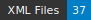

LIBER
=====================
   

**HTR datasets from medieval manuscripts (14th-15th c.) with Pierre Bersuire's translation into Old French of the work of Titus Livius and Nicolas Trevet Commentaries**

*project-website: https://anr.fr/Projet-ANR-21-CE27-0008*

Liber (2021-2025) is an research project funded by the ANR (Agence Nationale de Recherche). The project proposes to study the way in which Bersuire, in the 14th century, translated the Roman History of Titus Livius, a translation which was to have a major influence on the constitution of the French lexicon, particularly the political lexicon, and the construction of a historical science, based on Western conceptions of Roman institutions.

## License : 

CC-BY 4.0

## GT interface :

Data have been made in **eScriptorium**, see https://gitlab.com/scripta/escriptorium

## Transcription guidelines

Data follow the standards recommended by the CREMMALAB project, see Ariane Pinche. Transcription Guide for 10th to 15th Century Manuscripts. 2022. [hal-03697382](https://hal.science/hal-03697382/document) and Thibault Clérice, Malamatenia Vlachou-Efstathiou, Alix Chagué. CREMMA Medii Aevi: Literary manuscript text recognition in Latin. *Journal of Open Humanities Data*, 2023. [hal-03828353v5](https://hal-enc.archives-ouvertes.fr/hal-03828353v5)

## Sources

Data List :

| Shelfmark                                                                  | Biblissima                                     | Pages | Century | lang. | Color | Content                       | transcriber       |
|----------------------------------------------------------------------------|------------------------------------------------|-------|---------|-------|-------|-------------------------------|-------------------|
| [Paris, BnF, NAF, 27401](https://gallica.bnf.fr/ark:/12148/btv1b10532600x) | [→](https://data.biblissima.fr/entity/Q68441)  | 10    | 14th    | fro   | True  | Pierre Bersuire's translation | Davide Aruta      |
| [Paris, BnF, fr. 263](https://gallica.bnf.fr/ark:/12148/btv1b8451118s)    |    [→](https://data.biblissima.fr/w/Item:Q49920)                                         | 10    | 15th    | fro   | True  | Pierre Bersuire's translation | Martina Lenzi     |
| Lisboa, Bibi. nac., mss illum., 134-135.                                   | [→](https://data.biblissima.fr/entity/Q309089) | 17    | 15th    | lat   | True  | Nicolas Trevet Commentaries   | Armelle Le Huërou |

